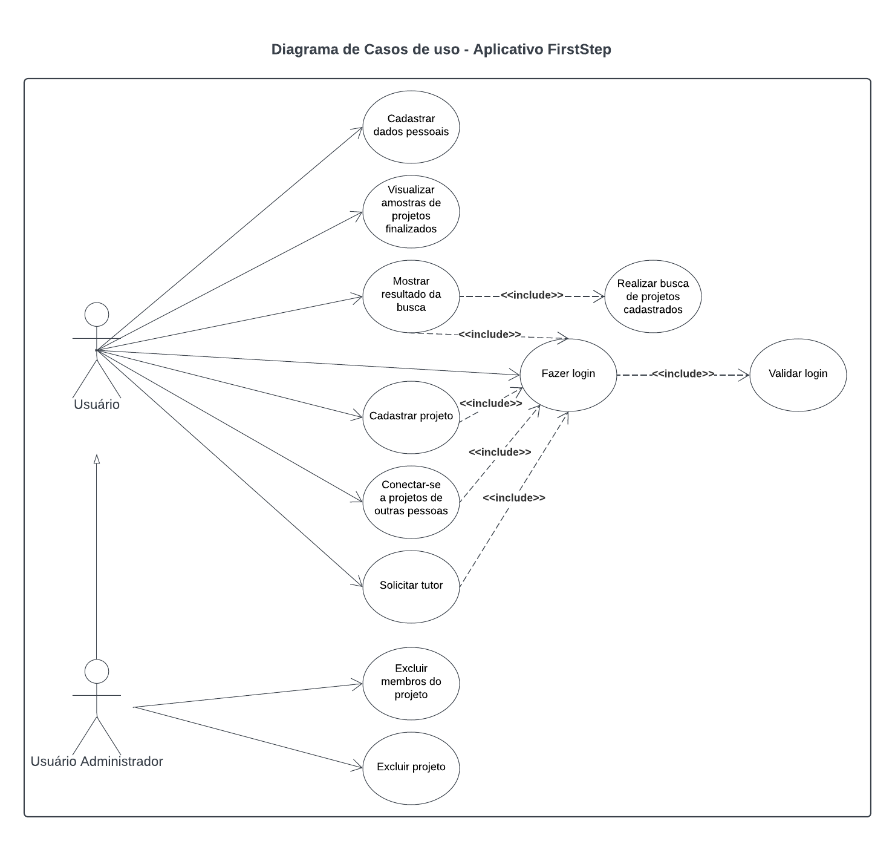
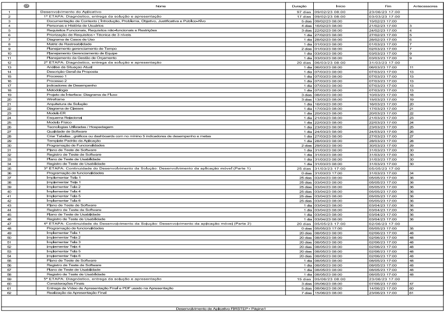

# Especificações do Projeto

Pré-requisitos: <a href="1-Documentação de Contexto.md"> Documentação de Contexto</a>

Definição do problema e ideia de solução a partir da perspectiva do usuário. É composta pela definição do  diagrama de personas, histórias de usuários, requisitos funcionais e não funcionais além das restrições do projeto.

Apresente uma visão geral do que será abordado nesta parte do documento, enumerando as técnicas e/ou ferramentas utilizadas para realizar a especificações do projeto

## Personas

|    Nathália Souza | Informações:                       |                                        |
|--------------------|------------------------------------|----------------------------------------|
|| **Idade:** 37 anos   **Ocupação:** formada em Engenharia de Software e fazendo pós graduação em Ciência de dados|**Aplicativos:** <ul>● Instagram  ● Linkedin  ● Telegram ● WhatsApp  </ul>|
|**Motivações:** <ul>● Concluir a faculdade.   ● Adquirir experiências com metodologias agéis. </ul>|**Frustrações:** <ul>● Dificuldade em conseguir estágio por não ter experiência;   ● Na faculdade não tem muita oportunidade de praticar a metodologia Ágil aplicada ao desenvolvimento de software.   |**Hobbies/Histórias:** <ul>● Cozinhar  ● Ler livros  ● Viajar  </ul>|

|    Lucas Hideaki | Informações:                       |                                        |
|--------------------|------------------------------------|----------------------------------------|
|| **Idade:**  23 anos   **Ocupação:** Recém Formado em Análise e Desenvolvimento |**Aplicativos:** <ul>● Instagram  ● GitHub  ● Discord ● Team Microsoft  </ul>|
|**Motivações:** <ul>● Gosta muito de utilizar aplicativos e por isso, quer se aprofundar mais nessa programação.      ● Conectar com pessoas para que possa desenvolver sistemas do nosso interesse.   </ul>|**Frustrações:** <ul>● Recentemente participou de um processo seletivo para júniores e estagiários, mesmo enviando vários trabalhos que havia feito o recrutador informou que a vaga foi ocupada por programadores mais experientes;   ● Maior frustação é estar formado e não ter consigo colocação na área.    |**Hobbies/Histórias:** <ul>● Gosta de jogar jogos on-line  ● Aprender programação em cursos de curta duração.    </ul>|

|    Lucas Hideaki | Informações:                       |                                        |
|--------------------|------------------------------------|----------------------------------------|
|| **Idade:**  46 anos   **Ocupação:** Motorista de aplicativo cursando faculdade de análise e desenvolvimento de sistema. |**Aplicativos:** <ul>● Instagram  ● Facebook   ● Twitter  ● Team Microsoft  </ul>|
|**Motivações:** <ul>● Encontrar grupos que trabalhem com linguagens de programação do seu interesse;       ● Ser um ótimo programador, sempre se atualizando e buscando por novos cursos na área. </ul>|**Frustrações:** <ul>● Devido à falta de experiência há poucas oportunidades, inclusive para estágios. |**Hobbies/Histórias:** <ul>● Jogar futebol;  ● Tocar violão.     </ul>|

## Histórias de Usuários

Com base na análise das personas forma identificadas as seguintes histórias de usuários:

|EU COMO... `PERSONA`| QUERO/PRECISO ... `FUNCIONALIDADE` |PARA ... `MOTIVO/VALOR`                 |
|--------------------|------------------------------------|----------------------------------------|
| Nathália Souza |  Ter oportunidade de praticar a metodologia Ágil no desenvolvimento de um projeto de software          | Para conseguir um estágio na área.              |
| Lucas Hideaki   |  Conseguir se ligar a projetos com ideias nas quais se conecte através de Aplicativo Móvel             | Para contribuir no desenvolvimento de sistemas e ganhar experiências.              |
| Lucas Hideaki   |  Quer ter certeza que os projetos propostos estão de acordo com que o mercado está exigindo           | Para ter maior aproveitamento de aprendizagem. .              |

## Modelagem do Processo de Negócio 

### Análise da Situação Atual

Embora haja grande demanda por profissionais de Tecnologia da Informação, muitos estudantes e recém-formados da área encontram bastante dificuldade de ingressar no mercado de trabalho. Isso ocorre, em grande parte, porque a maioria das vagas requer experiência profissional prévia. Dessa forma, muitos estudantes se dedicam a montar um portfólio pessoal de projetos como forma de demonstrar seus conhecimentos técnicos e utilizam o GitHub como repositório (ALCÂNTARA, OLIVEIRA, SILVA, 2022).  

Além disso, a rede social Linkedin é muito utilizada para criar conexões profissionais e divulgar os projetos feitos. Assim, recrutadores podem conhecer mais a pessoa e seu conhecimento profissional o que facilitaria uma futura contratação. Outro caminho muito procurado por estudantes são os bootcamps, treinamentos intensivos, muitas vezes realizados por empresas que buscam selecionar os melhores estudantes para ocupar vagas de emprego na sua empresa (SOUZA, 2022).  

No entanto, muitos estudantes sentem dificuldade de criar sozinhos projetos para seu portfólio pessoal e, quando participam dos bootcamps, muitos não conseguem acompanhar o treinamento por causa dos prazos curtos, além de abordarem somente temas de interesse da empresa que não necessariamente são os mesmos dos estudantes.   

### Descrição Geral da Proposta

Apresente aqui uma descrição da sua proposta abordando seus limites e suas ligações com as estratégias e objetivos do negócio. Apresente aqui as oportunidades de melhorias.

### Processo 1 – NOME DO PROCESSO

Apresente aqui o nome e as oportunidades de melhorias para o processo 1. Em seguida, apresente o modelo do processo 1, descrito no padrão BPMN. 

### Processo 2 – NOME DO PROCESSO

Apresente aqui o nome e as oportunidades de melhorias para o processo 2. Em seguida, apresente o modelo do processo 2, descrito no padrão BPMN.

## Indicadores de Desempenho

Apresente aqui os principais indicadores de desempenho e algumas metas para o processo. Atenção: as informações necessárias para gerar os indicadores devem estar contempladas no diagrama de classe. Colocar no mínimo 5 indicadores. 

Usar o seguinte modelo: 

Obs.: todas as informações para gerar os indicadores devem estar no diagrama de classe a ser apresentado a posteriori. 

## Requisitos

As tabelas que se seguem apresentam os requisitos funcionais e não funcionais que detalham o escopo do projeto. Para determinar a prioridade de requisitos, aplicar uma técnica de priorização de requisitos e detalhar como a técnica foi aplicada.

### Requisitos Funcionais

|ID    | Descrição do Requisito  | Prioridade |
|------|-----------------------------------------|----|
|RF-001| O aplicativo deve permitir cadastro de usuários. | ALTA | 
|RF-002| O aplicativo deve permitir login de usuários.  | ALTA |
|RF-003| O aplicativo deve permitir que o usuário se conecte a projeto já existente.     |   ALTA   |
|RF-004| O aplicativo deve ter no formulário de cadastro de projeto um campo que o usuário deva colocar a descrição da vaga de emprego.         |  ALTA   |
|RF-005|         |     | 
|RF-006| O aplicativo deve ter uma página com amostras de projetos finalizados.|  ALTA   |
|RF-007|         |     |
|RF-008|         |     | 
|RF-009|         |     |    

### Requisitos não Funcionais

|ID     | Descrição do Requisito  |Prioridade |
|-------|-------------------------|----|
|RNF-001| O sistema deve ser responsivo em dispositivo móvel. | ALTA | 
|RNF-002| O aplicativo deverá ser elaborado no React Native.  |  ALTA | 
|RNF-003| O aplicativo deve ter bom nível de contraste entre os elementos da tela em conformidade. | Baixa|
|RNF-004| O aplicativo deve ser compatível com as principais plataformas do mercado (IOS, Android).| ALTA|
|RNF-005| O sistema deverá garantir a segurança dos dados sensíveis do usuário por meio de criptografia.| ALTA |
|RNF-006| O sistema deverá estar disponível 24 horas por dia e 7 dias na semana. | ALTA |

   

Com base nas Histórias de Usuário, enumere os requisitos da sua solução. Classifique esses requisitos em dois grupos:

- [Requisitos Funcionais
 (RF)](https://pt.wikipedia.org/wiki/Requisito_funcional):
 correspondem a uma funcionalidade que deve estar presente na
  plataforma (ex: cadastro de usuário).
- [Requisitos Não Funcionais
  (RNF)](https://pt.wikipedia.org/wiki/Requisito_n%C3%A3o_funcional):
  correspondem a uma característica técnica, seja de usabilidade,
  desempenho, confiabilidade, segurança ou outro (ex: suporte a
  dispositivos iOS e Android).
Lembre-se que cada requisito deve corresponder à uma e somente uma
característica alvo da sua solução. Além disso, certifique-se de que
todos os aspectos capturados nas Histórias de Usuário foram cobertos.

## Restrições

O projeto está restrito pelos itens apresentados na tabela a seguir.

|ID| Restrição                                             |
|--|-------------------------------------------------------|
|RE-01| A equipe não pode subcontratar o desenvolvimento do trabalho.|   

Enumere as restrições à sua solução. Lembre-se de que as restrições geralmente limitam a solução candidata.

> **Links Úteis**:
> - [O que são Requisitos Funcionais e Requisitos Não Funcionais?](https://codificar.com.br/requisitos-funcionais-nao-funcionais/)
> - [O que são requisitos funcionais e requisitos não funcionais?](https://analisederequisitos.com.br/requisitos-funcionais-e-requisitos-nao-funcionais-o-que-sao/)

## Diagrama de Casos de Uso

O diagrama de casos de uso é o próximo passo após a elicitação de requisitos, que utiliza um modelo gráfico e uma tabela com as descrições sucintas dos casos de uso e dos atores. Ele contempla a fronteira do sistema e o detalhamento dos requisitos funcionais com a indicação dos atores, casos de uso e seus relacionamentos. 

# Matriz de Rastreabilidade

A matriz de rastreabilidade é uma ferramenta usada para facilitar a visualização dos relacionamento entre requisitos e outros artefatos ou objetos, permitindo a rastreabilidade entre os requisitos e os objetivos de negócio. 

A matriz deve contemplar todos os elementos relevantes que fazem parte do sistema, conforme a figura meramente ilustrativa apresentada a seguir.

> **Links Úteis**:
> - [Artigo Engenharia de Software 13 - Rastreabilidade](https://www.devmedia.com.br/artigo-engenharia-de-software-13-rastreabilidade/12822/)
> - [Verificação da rastreabilidade de requisitos usando a integração do IBM Rational RequisitePro e do IBM ClearQuest Test Manager](https://developer.ibm.com/br/tutorials/requirementstraceabilityverificationusingrrpandcctm/)
> - [IBM Engineering Lifecycle Optimization – Publishing](https://www.ibm.com/br-pt/products/engineering-lifecycle-optimization/publishing/)

# Gerenciamento de Projeto

De acordo com o PMBoK v6 as dez áreas que constituem os pilares para gerenciar projetos, e que caracterizam a multidisciplinaridade envolvida, são: Integração, Escopo, Cronograma (Tempo), Custos, Qualidade, Recursos, Comunicações, Riscos, Aquisições, Partes Interessadas. Para desenvolver projetos um profissional deve se preocupar em gerenciar todas essas dez áreas. Elas se complementam e se relacionam, de tal forma que não se deve apenas examinar uma área de forma estanque. É preciso considerar, por exemplo, que as áreas de Escopo, Cronograma e Custos estão muito relacionadas. Assim, se eu amplio o escopo de um projeto eu posso afetar seu cronograma e seus custos.

## Gerenciamento de Tempo

Com diagramas bem organizados que permitem gerenciar o tempo nos projetos, o gerente de projetos agenda e coordena tarefas dentro de um projeto para estimar o tempo necessário de conclusão.

O gráfico de Gantt ou diagrama de Gantt também é uma ferramenta visual utilizada para controlar e gerenciar o cronograma de atividades de um projeto. Com ele, é possível listar tudo que precisa ser feito para colocar o projeto em prática, dividir em atividades e estimar o tempo necessário para executá-las.

## Gerenciamento de Equipe

O gerenciamento adequado de tarefas contribuirá para que o projeto alcance altos níveis de produtividade. Por isso, é fundamental que ocorra a gestão de tarefas e de pessoas, de modo que os times envolvidos no projeto possam ser facilmente gerenciados. 

## Gestão de Orçamento

O processo de determinar o orçamento do projeto é uma tarefa que depende, além dos produtos (saídas) dos processos anteriores do gerenciamento de custos, também de produtos oferecidos por outros processos de gerenciamento, como o escopo e o tempo.

