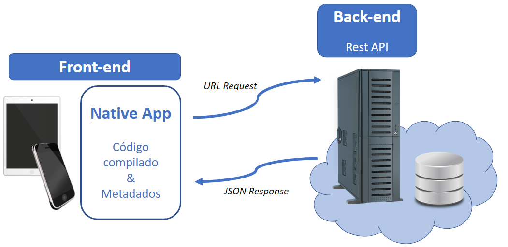
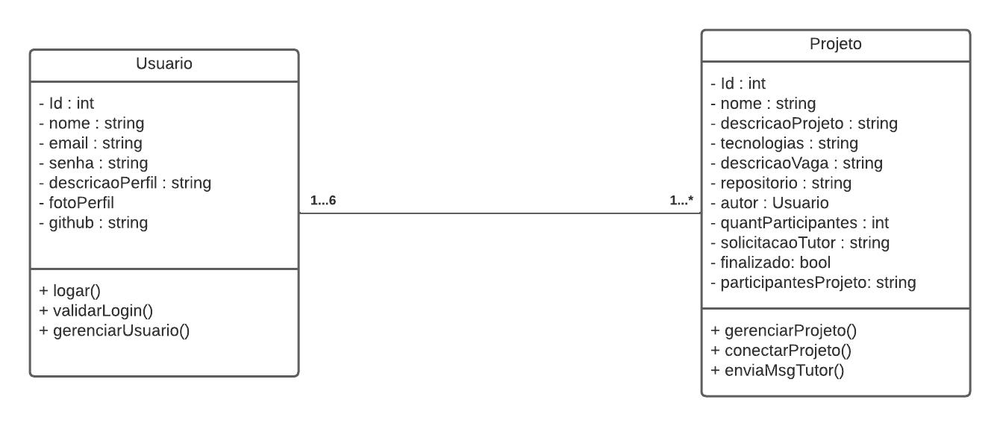
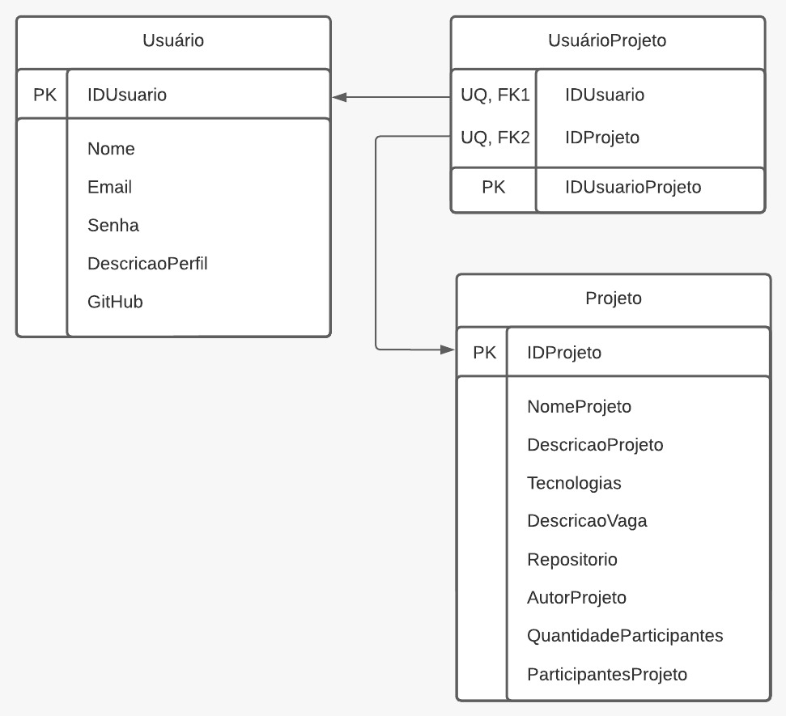
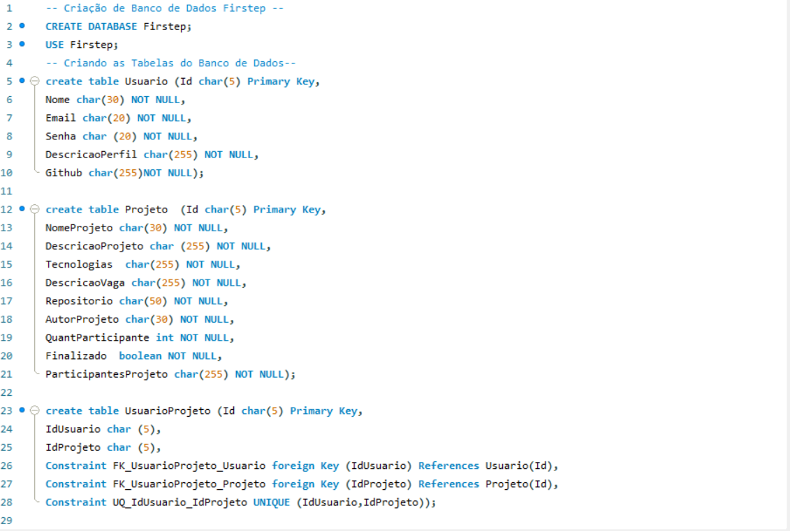

# Arquitetura da Solução

Pré-requisitos: <a href="3-Projeto de Interface.md"> Projeto de Interface</a>

Definição de como o software é estruturado em termos dos componentes que fazem parte da solução e do ambiente de hospedagem da aplicação.

## Diagrama de Classes

O diagrama de classes ilustra graficamente como será a estrutura do software, e como cada uma das classes da sua estrutura estarão interligadas. Essas classes servem de modelo para materializar os objetos que executarão na memória.

## Modelo ER

O Modelo ER representa através de um diagrama como as entidades (coisas, objetos) se relacionam entre si na aplicação interativa.

 

## Esquema Relacional

O Esquema Relacional corresponde à representação dos dados em tabelas juntamente com as restrições de integridade e chave primária.

 

 Usuário(IDUsuario (PK), Nome, E-mail (UNIQUE), Senha, Descrição / Perfil, Github)

 Projeto (IDProjeto (PK), IDUsuario (FK), Nome do Projeto, Descrição do Projeto, Tecnologia , Descrição da Vaga, Repositório, Autor do Projeto, Quantidade de Participantes)

## Modelo Físico

Banco de Dados Firstep. 

 

Entregar um arquivo banco.sql contendo os scripts de criação das tabelas do banco de dados. Este arquivo deverá ser incluído dentro da pasta src\bd.

## Tecnologias Utilizadas

|Função    | Tecnologia  | 
|------------|-----------------------------------------|
| Linguagem | JavaScript | 
| Framework | ReactNative | 
| Bibliotecas | React Native Paper, React Navigation, Json server, Json server auth, Axios | 
| IDE | Visual Studio Code | 
| Ferramentas | Microsoft Teams, GitHub, Whatsapp | 
| Banco de dados | MySQL | 

 

 

## Hospedagem

A hospedagem será realizada pelo Heroku, uma plataforma de nuvem como serviço que suporta várias linguagens de programação.

## Qualidade de Software

Conceituar qualidade de fato é uma tarefa complexa, mas ela pode ser vista como um método gerencial que através de procedimentos disseminados por toda a organização, busca garantir um produto final que satisfaça às expectativas dos stakeholders.

No contexto de desenvolvimento de software, qualidade pode ser entendida como um conjunto de características a serem satisfeitas, de modo que o produto de software atenda às necessidades de seus usuários. Entretanto, tal nível de satisfação nem sempre é alcançado de forma espontânea, devendo ser continuamente construído. Assim, a qualidade do produto depende fortemente do seu respectivo processo de desenvolvimento.

A norma internacional ISO/IEC 25010, que é uma atualização da ISO/IEC 9126, define oito características e 30 subcaracterísticas de qualidade para produtos de software.
Com base nessas características e nas respectivas sub-características, identifique as sub-características que sua equipe utilizará como base para nortear o desenvolvimento do projeto de software considerando-se alguns aspectos simples de qualidade. Justifique as subcaracterísticas escolhidas pelo time e elenque as métricas que permitirão a equipe avaliar os objetos de interesse.
|Característica de Qualidade| Subcaracterísticas |Justificativa      |
|--------------------|------------------------------------|----------------------------------------|
| ● Adequação Funcional  |         Adequação            Acurácia        Conformidade  | Prover um conjunto apropriado de funções para tarefas e objetivos do usuário especificados.    Prover, com o grau de precisão necessário, resultados ou efeitos corretos ou conforme acordados.   O software deve estar de acordo com normas, convenções ou regulamentações previstas em leis e prescrições similares relacionadas à funcionalidade.
|    ●  Eficiência de Desempenho          |   Comportamento em relação aos recursos           |  Capacidade do produto de software de usar tipos e quantidades apropriados de recursos, quando o software executa suas funções sob condições estabelecidas.
| ● Compatibilidade   |       Interoperabilidade       |   Capacidade do produto de software de interagir com um ou mais sistemas especificados.
|● Usabilidade                            |    Inteligibilidade         Apreensibilidade         Operacionalidade     |  Capacidade do produto de software de possibilitar ao usuário compreender se o software é apropriado e como ele pode ser usado para tarefas e condições de uso específicas.      Capacidade do produto de software de possibilitar ao usuário aprender sua aplicação.      Capacidade do produto de software de possibilitar ao usuário operá-lo e controlá-lo.
| ● Manutenibilidade   |   Modularidade        Analisabilidade        Modificabilidade         Testabilidade    |   A modularização (ou componentização) é o mecanismo que permite que um sistema de software seja dividido em partes que interagem entre si.      Capacidade do produto de software de permitir o diagnóstico de deficiências ou causas de falhas no software, ou a identificação de partes a serem modificadas.      Capacidade do produto de software de permitir que uma modificação especificada seja implementada.      Capacidade do produto de software de permitir que o software, quando modificado, seja validado.
| ● Portabilidade  |  Coexistência            |Capacidade do produto de software de coexistir com outros produtos de software independentes, em um ambiente comum, compartilhando recursos comuns.
| ● Confiabilidade  | Tolerância a falhas             |Capacidade do produto de software de manter um nível de desempenho especificado em casos de defeitos no software ou de violação de sua interface especificada.
| ● Segurança   |  Confidencialidade             |Capacidade do produto de software de proteger informações e dados, de forma que pessoas ou sistemas não autorizados não possam lê-los nem modificá-los e que não seja negado o acesso às pessoas ou sistemas autorizados.

|Subcaracterísticas| Métrica |Escala      |Peso      |
|--------------------|------------------------------------|----------------------------------------|----------------------------------------|
|Adequação | O sistema propõe-se a fazer o que é apropriado? |1) Não atende  2) Atende parcialmente  3) Atende completamente       |ALTO      |
|Acurácia| O sistema gera resultados corretos conforme acordado?|1) Não atende  2) Atende parcialmente  3) Atende completamente    |ALTO        |
|Conformidade| O sistema está de acordo com normas e convenções previstas em leis e descrições similares?|1) Não atende  2) Atende parcialmente  3) Atende completamente     |ALTO        |
|Comportamento em relação aos recursos| Quanto recurso o sistema utiliza? |1) Pouco  2) Suficiente  3) Muito       |ALTO        |
|Interoperabilidade| O sistema é capaz de interagir com os sistemas especificados? |1) Não atende  2) Atende parcialmente  3) Atende completamente      |ALTO        |
|Inteligibilidade| É fácil entender como utilizar o software ? |1) Não atende  2) Atende parcialmente  3) Atende completamente      |ALTO        |
|Apreensibilidade| É fácil aprender a usar? |1) Não atende  2) Atende parcialmente  3) Atende completamente      |ALTO        |
|Operacionalidade| É fácil de operar e controlar a operação? |1) Não atende  2) Atende parcialmente  3) Atende completamente    |ALTO        |
|Modularidade| As partes (módulos) do sistema estão integragindo entre si ? |1) Não atende  2) Atende parcialmente  3) Atende completamente     |ALTO        |
|Analisabilidade| É fácil diagnosticar eventuais problemas e identificar as causas das deficiências ou falhas? |1) Sim  2) Não       |ALTO        |
|Modificabilidade| Qual a complexidade de implementar modificações ? |1) Alta  2) Baixa  3) Média      |ALTO        |
|Testabilidade| Qual a complexidade de se validar o software ?  |1) Alta  2) Baixa  3) Média       |ALTO        |
|Coexistência| O sistema de software pode coexistir com outros produtos de software independentes ? |1) Sim  2) Não       |ALTO        |
|Tolerância a falhas | Ocorrendo falhas, o sistema está parametrizado para reagir ? |1) Sim  2) Não       |ALTO        |
|Confidencialidade | O sistema evita acesso não autorizado, acidental ou deliberado a programas de dados? |1) Sim  2) Não       |ALTO        |
